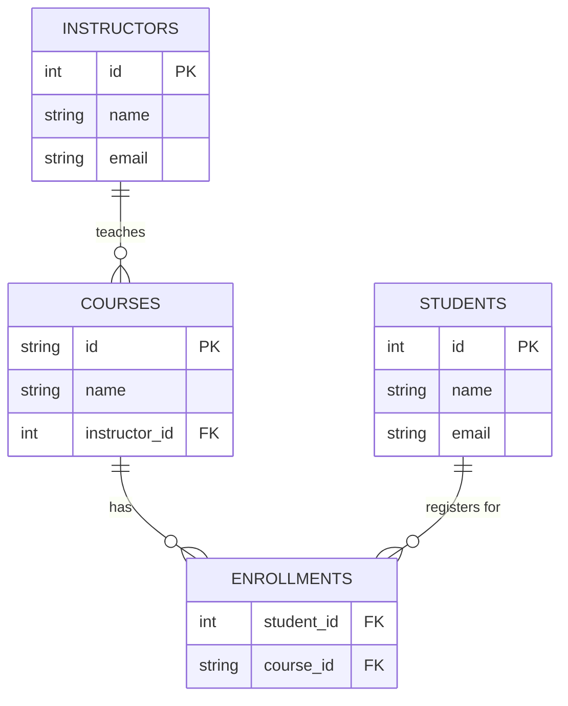

# Diagnosing and Normalizing a Broken Academic Schema

## 1. Why The Old Table Was Problematic (Anomalies)
The original `student_courses` table was a single, flat, unnormalized table representing multiple concepts (students, courses, instructors, and enrollments) at once. This led to severe issues:
- **Update Anomaly:** Modifying an instructor's email or a student's name would require updating many rows across the table. Missing even one row results in data inconsistency.
- **Insert Anomaly:** It is impossible to add a new course or a new instructor to the system without also inventing a fake student to fill the student columns.
- **Delete Anomaly:** If a student decides to drop the only class they were taking (or if the only student in a class drops it), deleting that row would accidentally delete all information about the course and its instructor too.

## 2. Proposed Normalized Schema
To resolve these anomalies and reach the **Third Normal Form (3NF)**, we must separate the tables so each table describes a single entity, and use foreign keys to represent relationships. 

### SQL Schema (New Design)
```sql
-- Represents individual students
CREATE TABLE students (
    id INTEGER PRIMARY KEY,
    name TEXT NOT NULL,
    email TEXT UNIQUE NOT NULL
);

-- Represents individual instructors
CREATE TABLE instructors (
    id INTEGER PRIMARY KEY,
    name TEXT NOT NULL,
    email TEXT UNIQUE NOT NULL
);

-- Represents courses and associates them with a single instructor
CREATE TABLE courses (
    id TEXT PRIMARY KEY,
    name TEXT NOT NULL,
    instructor_id INTEGER NOT NULL,
    FOREIGN KEY(instructor_id) REFERENCES instructors(id)
);

-- Junction table to manage the Many-to-Many relationship between students and courses
CREATE TABLE enrollments (
    student_id INTEGER NOT NULL,
    course_id TEXT NOT NULL,
    PRIMARY KEY(student_id, course_id),
    FOREIGN KEY(student_id) REFERENCES students(id),
    FOREIGN KEY(course_id) REFERENCES courses(id)
);
```

### 3. Entity-Relationship Diagram (Mermaid)


## Summary
By separating `instructors`, `courses`, and `students` into their own entities, and linking them via foreign keys and the `enrollments` junction table:
- An instructor's email is updated in exactly **one place** (`instructors` table).
- We can add a course without any students being enrolled yet (`courses` table).
- Dropping an enrollment only deletes a row in `enrollments`, keeping the course, instructor, and student data perfectly intact.
