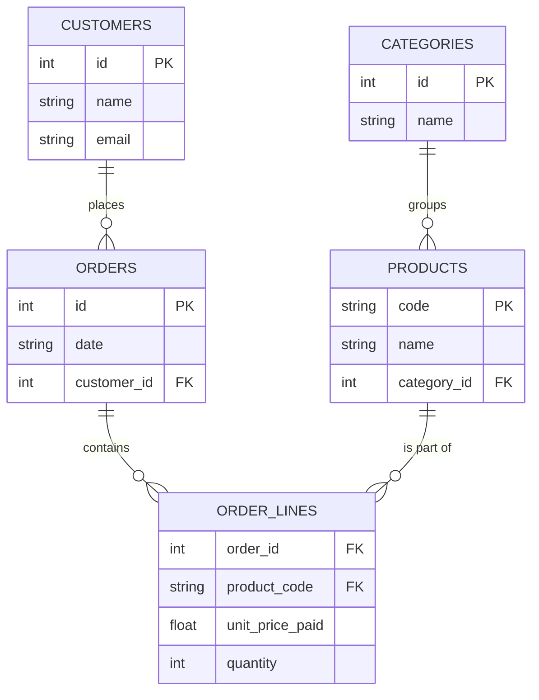

# Redesigning an Order System from a Flat Table

## 1. Justification for `unit_price_paid`
The column `unit_price_paid` should be placed in the **order_items (line items)** table, **not** exclusively in the `products` table. 
While products generally have a current price (e.g. `base_price` in the products table), the actual price a customer pays at the moment of checkout (`unit_price_paid`) must be historically preserved. If price is only stored in the `products` table, updating the price of a product today would retroactively change the financial value of orders placed years ago, destroying historical accuracy and financial reporting.

## 2. Proposed Normalized Schema (Third Normal Form)

### SQL Schema
```sql
-- Represents a single customer
CREATE TABLE customers (
    id INTEGER PRIMARY KEY AUTOINCREMENT,
    name TEXT NOT NULL,
    email TEXT UNIQUE NOT NULL
);

-- Represents categories for products
CREATE TABLE categories (
    id INTEGER PRIMARY KEY AUTOINCREMENT,
    name TEXT UNIQUE NOT NULL
);

-- Represents individual products
CREATE TABLE products (
    code TEXT PRIMARY KEY,
    name TEXT NOT NULL,
    category_id INTEGER,
    -- current base price could exist here, but unit_price_paid stays in order_lines
    FOREIGN KEY(category_id) REFERENCES categories(id)
);

-- Represents an order placed by a customer
CREATE TABLE orders (
    id INTEGER PRIMARY KEY,
    date TEXT NOT NULL,
    customer_id INTEGER NOT NULL,
    FOREIGN KEY(customer_id) REFERENCES customers(id)
);

-- Represents the many-to-many junction (line items) between orders and products
CREATE TABLE order_lines (
    order_id INTEGER NOT NULL,
    product_code TEXT NOT NULL,
    quantity INTEGER NOT NULL,
    unit_price_paid REAL NOT NULL,
    PRIMARY KEY(order_id, product_code),
    FOREIGN KEY(order_id) REFERENCES orders(id),
    FOREIGN KEY(product_code) REFERENCES products(code)
);
```

### 3. Entity-Relationship Diagram (Mermaid)



## Summary Checklist
- Customer data is extracted out to `customers`.
- Order-level data (date, customer) is extracted out to `orders`.
- Product data is split into `products` and `categories`.
- Item-level quantity and `unit_price_paid` are preserved correctly inside the `order_lines` junction table, ensuring no insert/update/delete anomalies and preserving price history.
