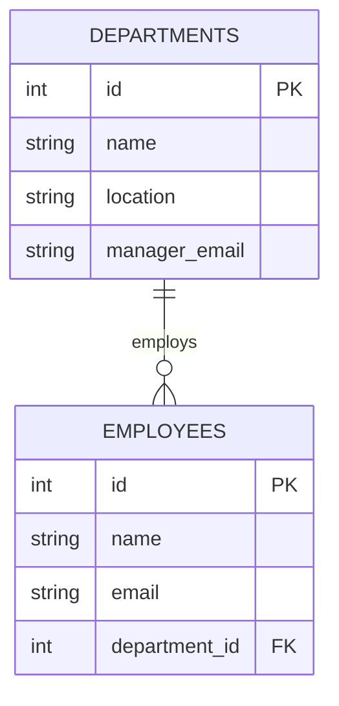

# Removing a Transitive Dependency from an Employee Table

## 1. Explanation of the Dependency Problem
The original `employees_departments` table violates the **Third Normal Form (3NF)** because it contains a **transitive dependency**. 
In 3NF, every non-key column must depend *directly and only* on the primary key (`employee_id`). 
However, columns like `department_name`, `department_location`, and `department_manager_email` depend entirely on the `department_id`, which itself depends on `employee_id`. 

Because of this transitive dependency (`employee` → `department`, `department` → `location`), any change to a department's detail (like a location move or a manager change) requires updating every individual employee record belonging to that department. This causes severe update anomalies.

## 2. Proposed Normalized Schema (Third Normal Form)

### SQL Schema
To fix this, we split the data into an `employees` table and a `departments` table. The `employees` table simply holds a foreign key pointing back to the department.

```sql
-- Represents individual departments
CREATE TABLE departments (
    id INTEGER PRIMARY KEY,
    name TEXT NOT NULL,
    location TEXT NOT NULL,
    manager_email TEXT NOT NULL
);

-- Represents individual employees linked to a department
CREATE TABLE employees (
    id INTEGER PRIMARY KEY,
    name TEXT NOT NULL,
    email TEXT UNIQUE NOT NULL,
    department_id INTEGER NOT NULL,
    FOREIGN KEY(department_id) REFERENCES departments(id)
);
```

### 3. Entity-Relationship Diagram (Mermaid)



## Summary Checklist
- Department information (`name`, `location`, `manager_email`) is stored exactly **once** in the `departments` table.
- The `employees` table no longer repeats these department attributes—it only stores the foreign key (`department_id`).
- Moving a department to a new location now requires exactly **one single row update** in the `departments` table. No other queries are affected.
