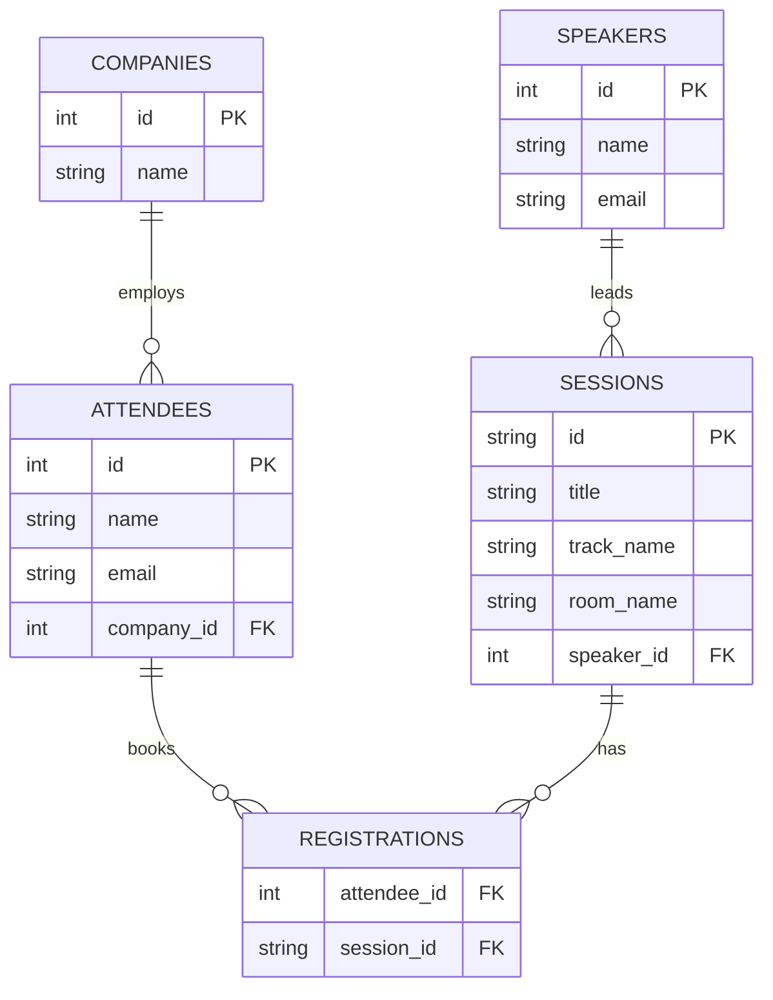

# Normalizing a Conference Registration System

## 1. Entities Identified
By inspecting the flattened `conference_registrations_flat` data and addressing insertion/update/deletion anomalies, the following specific entities were identified:
- **Attendees:** Records details of the individuals who came to the conference.
- **Companies:** Extracted into its own table so we can update a generic company name centrally rather than updating it across 100 attendees if it changes its branding.
- **Speakers:** Records individuals leading the sessions. Separating this resolves update anomalies when a speaker modifies their contact info.
- **Sessions:** Records details like the title, track, and room. By putting this in its own table, a session can exist before any attendees enroll.
- **Registrations:** A junction table capturing the Many-to-Many dependency between Attendees and Sessions.

## 2. Proposed Normalized Schema (Third Normal Form)

### SQL Schema
```sql
CREATE TABLE companies (
    id INTEGER PRIMARY KEY AUTOINCREMENT,
    name TEXT UNIQUE NOT NULL
);

CREATE TABLE attendees (
    id INTEGER PRIMARY KEY AUTOINCREMENT,
    name TEXT NOT NULL,
    email TEXT UNIQUE NOT NULL,
    company_id INTEGER,
    FOREIGN KEY(company_id) REFERENCES companies(id)
);

CREATE TABLE speakers (
    id INTEGER PRIMARY KEY AUTOINCREMENT,
    name TEXT NOT NULL,
    email TEXT UNIQUE NOT NULL
);

CREATE TABLE sessions (
    id TEXT PRIMARY KEY,
    title TEXT NOT NULL,
    track_name TEXT NOT NULL,
    room_name TEXT NOT NULL,
    speaker_id INTEGER NOT NULL,
    FOREIGN KEY(speaker_id) REFERENCES speakers(id)
);

CREATE TABLE registrations (
    attendee_id INTEGER NOT NULL,
    session_id TEXT NOT NULL,
    PRIMARY KEY(attendee_id, session_id),
    FOREIGN KEY(attendee_id) REFERENCES attendees(id),
    FOREIGN KEY(session_id) REFERENCES sessions(id)
);
```

### 3. Entity-Relationship Diagram (Mermaid)



## Summary Checklist
- **Speaker and Session details:** Normalized out into separate tables so `Dr. Smith` updates are central and sessions can exist empty.
- **Company Name:** Abstracted into its own entity out of 'attendees'. If fifty attendees share the 'Acme' company and it rebrands to 'Acme Global', keeping the company name centralized avoids spelling errors/anomalies vs plain text storage.
- **Registrations (Many-to-Many):** Mapped into a standalone junction table linking Session IDs to Attendee IDs.
